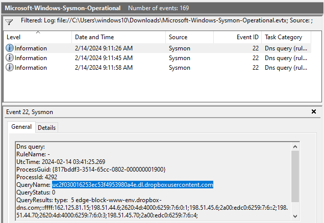

# Unit42

## Scenario:

Palo Alto's Unit42 recently conducted research on an UltraVNC campaign, wherein attackers utilized a backdoored version of UltraVNC to maintain access to systems. This lab is inspired by that campaign and guides participants through the initial access stage of the campaign.

## Tools used:

- Event Viewer
- Sysmon
- VirusTotal

## Skills learnt:

- Event Log Analysis
- Sysmon Log analysis
- UltraVNC infection campaign
- Timeline creation
- Contextual Analysis

## Investigation process:

After downloading the artefacts, I unzipped them and found a `.evtx` file named `Microsoft-Windows-SysmonOperational.evtx`, which I opened in **Event Viewer**. The file contains 169 Sysmon events.

To find out how many event logs have Event ID 11 (which indicates a file was created on a host within Sysmon logs), I went to **Filter Current Log** in the **Actions** panel, filtered by **ID 11**, and the results showed **56 logs**.

Whenever a process is created in memory, an event with Event ID 1 is recorded with details such as the command line, hashes, process path, parent process path, etc. This information is very useful for an analyst because it allows us to see all programs executed on a system, which means we can spot any malicious processes being executed. What is the malicious process that infected the victim's system?

To determine which malicious process infected the victim's system, I filtered by created processes with **Event ID 1**, which returned 6 events. Looking through them, a suspicious event caught my eye, as it had a double `.exe` extension and was executed from the **Downloads** folder.

Checking the hash in VirusTotal I confirmed that this is a malicious executable:

To determine which cloud drive was used to distribute the malware, I filtered by Event ID 22, which corresponds to DNS queries made by the system. That returned only 3 event logs, and the first one immediately caught my eye, showing a query to `dropbox`:

For many of the files written to disk, the initial malicious file used a defense evasion technique called Time Stomping, where the file creation date is changed to make it appear older and blend in with other files. The next question is: what was the timestamp changed to for the `PDF` file?
I filtered by **Event ID 2**, which records any file creation time changes on the system. That resulted in **16** events. I looked for a `PDF` file, and once I found it, I checked the **CreationUtcTime**, which was `2024-01-14 08:10:06`.

The next step is to determine where the `once.cmd` file was created on disk, so I filtered by **Event ID 11**, which logs when a file is created. This showed 56 events. Then, I searched by the filename **"once.cmd"**, which returned 2 results: the first created by `msiexec` and the second by `preventivo24.02.14.exe`:

As I determined at the beginning that `preventivo24.02.14.exe` was the executable that infected the victim's system, I concluded that the path is `C:\Users\CyberJunkie\AppData\Roaming\Photo and Fax Vn\Photo and vn 1.1.2\install\F97891C\WindowsVolume\Games\once.cmd`.

To determine the dummy domain the malicious file attempted to reach, I filtered by **Event ID 22**, which captures DNS queries made by processes. After filtering, I got 3 results, and by checking them, I found that `www.example.com` is the dummy domain.

Next, to find out which IP address the malicious process tried to reach, I filtered by **Event ID 3**, which records outgoing network connections initiated by processes. I found only 1 event, and in the **DestinationIP** field, the address was `93.184.216.34`:

The final question is: when did the malicious process terminate itself? I filtered by **Event ID 5**, which logs process termination events. This showed 1 result, with the date `2024-02-14 03:41:58`:

## Conclusion:

The attacker deployed a backdoored **UltraVNC** executable named `preventivo24.02.14.exe.exe` via **Dropbox**. By analyzing the logs, I identified malicious activity, file creation, DNS queries, and process termination.
